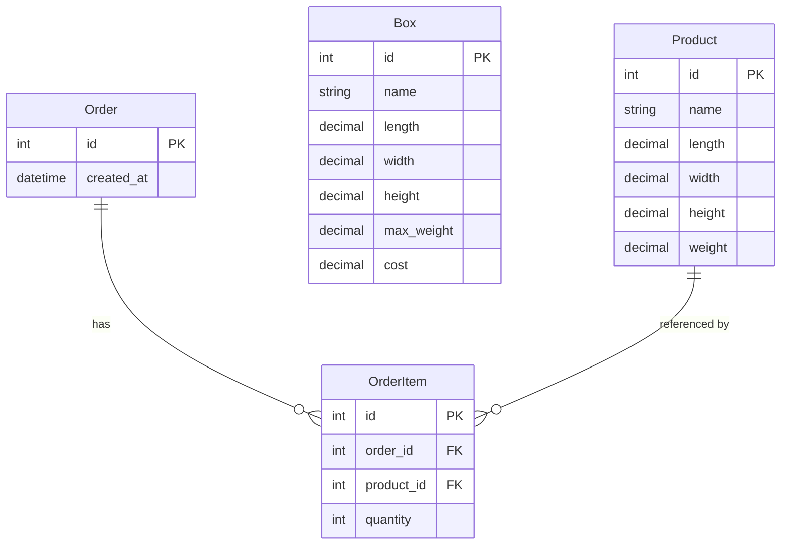

# Data Model Design — Box Recommendation System

Derived from [REQUIREMENTS.md](file:///c:/Users/Rohit/assesment/REQUIREMENTS.md) (FR-1 through FR-3) and [architecture proposal](file:///c:/Users/Rohit/assesment/architecture_proposal.md).

---

## Entity Relationship



---

## Models and Rationale

### Product

Represents a physical item that can be ordered.

| Field | Type | Why |
|---|---|---|
| `name` | `CharField(max_length=200)` | Human-readable identifier (FR-1). 200 chars is generous for product names. |
| `length` | `DecimalField(max_digits=10, decimal_places=2)` | Physical dimension in cm. |
| `width` | `DecimalField(max_digits=10, decimal_places=2)` | Physical dimension in cm. |
| `height` | `DecimalField(max_digits=10, decimal_places=2)` | Physical dimension in cm. |
| `weight` | `DecimalField(max_digits=10, decimal_places=2)` | Weight in kg. |

**Why DecimalField, not FloatField?** Decimal avoids floating-point rounding errors. When comparing "does this product fit in this box?", we need exact comparison — `29.99 <= 30.00` must be reliable, not subject to `29.990000000000002`.

**Why no SKU field?** FR-1 says "name or SKU." For this scope, `name` is sufficient. Adding a separate `sku` field with uniqueness constraints adds complexity without solving a problem the assignment defines.

---

### Box

Represents a shipping box the warehouse has in stock.

| Field | Type | Why |
|---|---|---|
| `name` | `CharField(max_length=200)` | Human-readable identifier (FR-2), e.g. "Small Box", "Large Flat". |
| `length` | `DecimalField(max_digits=10, decimal_places=2)` | Internal dimension in cm. |
| `width` | `DecimalField(max_digits=10, decimal_places=2)` | Internal dimension in cm. |
| `height` | `DecimalField(max_digits=10, decimal_places=2)` | Internal dimension in cm. |
| `max_weight` | `DecimalField(max_digits=10, decimal_places=2)` | Maximum weight capacity in kg. |
| `cost` | `DecimalField(max_digits=10, decimal_places=2)` | Cost per box in currency units. This is the optimisation target — we pick the cheapest fitting box. |

**Why `max_weight` and not `weight`?** Clarity. The box itself has a physical weight, but the assignment only cares about weight *capacity*. Naming it `max_weight` makes the field's purpose unambiguous.

---

### Order

Represents a customer order that needs a box recommendation.

| Field | Type | Why |
|---|---|---|
| `created_at` | `DateTimeField(auto_now_add=True)` | Timestamp for traceability. Auto-set on creation. |

**Why so minimal?** The assignment doesn't mention customer info, addresses, statuses, or payment. An order is just a container for items that we need to find a box for. No fields beyond what's needed.

**Why have an Order model at all?** It groups `OrderItem` rows together. Without it, there's no way to say "these 3 items belong to the same order." It also provides a stable ID for the recommendation API to reference.

---

### OrderItem

The join table between Order and Product. Represents "this order contains N of this product."

| Field | Type | Why |
|---|---|---|
| `order` | `ForeignKey(Order, on_delete=CASCADE, related_name='items')` | Which order this belongs to. CASCADE because items don't exist without their order. |
| `product` | `ForeignKey(Product, on_delete=PROTECT, related_name='order_items')` | Which product. PROTECT because deleting a product that's part of an existing order would break data integrity. |
| `quantity` | `PositiveIntegerField` | How many of this product. Enforced ≥ 1 at DB level. |

**Why `CASCADE` on Order but `PROTECT` on Product?** 
- If you delete an order, its items are meaningless — cascade them away.
- If you try to delete a product that appears in past orders, that's a data integrity problem — block it.

**Why `related_name='items'`?** So you can write `order.items.all()` — clean and readable in the service layer.

---

## Constraints

### Database-Level (enforced by Django field types)

| Constraint | How |
|---|---|
| Dimensions and weight must be positive | `DecimalField` with `MinValueValidator(0.01)` — zero-dimension products don't make physical sense |
| Quantity must be ≥ 1 | `PositiveIntegerField` enforces ≥ 1 at DB level |
| Names cannot be blank | `CharField` with `blank=False` (default) |
| Cost must be non-negative | `DecimalField` with `MinValueValidator(0)` — a free box is valid, a negative-cost box is not |

### Application-Level (enforced in views/services)

| Constraint | Where |
|---|---|
| An order must have at least one item | View layer (validate before calling service) |
| Product IDs in request must exist | View layer (validate before calling service) |

### What I'm NOT constraining

| Skipped constraint | Why |
|---|---|
| Unique product name | Not required. Two products can have the same name (e.g. "Widget v1", "Widget v1" in different sizes). |
| Unique box name | Same reasoning. |
| Max items per order | Assignment doesn't mention a limit. |
| `unique_together` on (order, product) | An order *could* have the same product in two line items (e.g. gift wrap vs. no gift wrap). Simpler to allow duplicates and sum quantities in the service. |

---

## Validation Strategy

```
                      View                    Model                     DB
                      ────                    ─────                     ──
JSON shape valid?     ✓ (400 if not)
product_id exists?    ✓ (400 if not)
quantity > 0?         ✓ (400 if not)          PositiveIntegerField      CHECK constraint
dimensions > 0?                               MinValueValidator         CHECK constraint
weight > 0?                                   MinValueValidator         CHECK constraint
name not blank?                               CharField default         NOT NULL
```

The view catches bad *requests*. The model catches bad *data*. The DB is the last line of defence. Three layers, each doing the validation appropriate to its level.

---

## `__str__` Methods

Every model gets a `__str__` for admin readability:

| Model | `__str__` output |
|---|---|
| `Product` | `"Widget (10×5×3 cm, 0.5 kg)"` |
| `Box` | `"Medium Box (30×20×15 cm, max 5 kg, $3.50)"` |
| `Order` | `"Order #7 (2026-08-19)"` |
| `OrderItem` | `"2× Widget in Order #7"` |

---

## What's Next

Once you approve this schema, I'll write `models.py`, run `makemigrations` + `migrate`, and verify in the Django shell. That completes Milestone 1.
